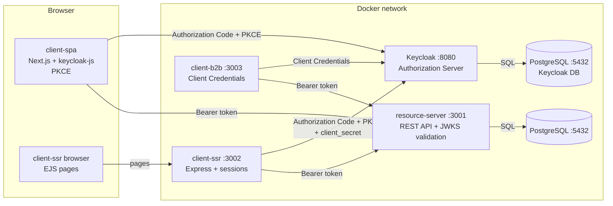

# Animal Help App

A multi-service animal shelter application — browse and adopt animals, manage volunteers,
and generate operational reports. Built on OAuth2 with Keycloak as the Authorization
Server, three separate client types, and the whole stack runnable with a single
`docker compose up`.

<p>
  
  
  
  
  
</p>

## Overview

Animal Help App is a full-stack shelter management platform demonstrating three distinct
OAuth2 client patterns side by side. A Next.js SPA handles public browsing and adoption
requests using Authorization Code + PKCE via `keycloak-js`. A server-rendered Express
client handles authenticated views and Google OAuth2 login with server-side sessions. A
headless B2B client uses Client Credentials to pull an operational report — no user
involved. All three talk to a single Express REST API that validates JWTs manually via
JWKS, without any auth library.

## Table of Contents

- [Animal Help App](#animal-help-app)
  - [Overview](#overview)
  - [Table of Contents](#table-of-contents)
  - [Features](#features)
  - [Architecture](#architecture)
  - [Tech Stack](#tech-stack)
  - [Getting Started](#getting-started)
    - [Prerequisites](#prerequisites)
    - [Clone](#clone)
    - [Run with Docker Compose](#run-with-docker-compose)
    - [Environment Variables](#environment-variables)
  - [Services](#services)
  - [User Roles](#user-roles)
  - [OAuth2 Architecture](#oauth2-architecture)
  - [API Reference](#api-reference)
  - [Project Structure](#project-structure)
  - [Pending Updates](#pending-updates)

## Features

**Animals**
- Browse all animals with filtering by species, status, and name search
- Admin panel — add animals with photo upload, change statuses, delete records
- Adoption applications — submit, track, accept, and reject

**Volunteer system**
- Admin creates dated tasks with time slots
- Volunteers sign up for tasks; their schedule appears instantly in "My Tasks"
- Role promotion — a regular user can apply to become a volunteer

**Authentication**
- Login and registration via Keycloak (OAuth2 + OpenID Connect)
- Google OAuth2 login with profile preview (SSR client)
- Two-factor authentication (2FA / OTP) via Google Authenticator
- Password reset (Forgot password) via Mailtrap SMTP sandbox

**B2B Report**
- Machine-to-machine access — no user, no browser
- Operational dashboard: animal breakdown by species/sex/age, adoption success rate, volunteer count

## Architecture



## Tech Stack

| Layer | Technology |
|---|---|
| Authorization Server | Keycloak 24 |
| Resource Server | Node.js 20, Express, `pg` |
| Client SPA | Next.js 15 (App Router), keycloak-js |
| Client SSR | Node.js 20, Express, EJS, express-session |
| Client B2B | Node.js 20, Express, axios |
| Database | PostgreSQL 17 |
| File storage | Docker volume (animal photos) |
| Infrastructure | Docker Compose |

## Getting Started

### Prerequisites

| Tool | Version |
|---|---|
| Docker Desktop | latest |
| Docker Compose | v2+ |

### Clone

```bash
git clone https://github.com/jpolchowska/animal-help-app.git
cd animal-help-app
```

### Run with Docker Compose

```bash
cp .env.example .env
# fill in .env with your values
docker compose up --build
```

Keycloak automatically imports the `animal-help-app` realm from
`auth-server/realm-export.json` on first start.

Rebuild a single service after a code change:

```bash
docker compose up --build resource-server
```

### Environment Variables

Copy `.env.example` to `.env` and fill in the values:

| Variable | Description |
|---|---|
| `POSTGRES_PASSWORD` | PostgreSQL database password |
| `SSR_CLIENT_SECRET` | SSR client secret from Keycloak Admin Console |
| `B2B_CLIENT_SECRET` | B2B client secret from Keycloak Admin Console |
| `GOOGLE_CLIENT_ID` | Client ID from Google Cloud Console |
| `GOOGLE_CLIENT_SECRET` | Client Secret from Google Cloud Console |

## Services

| Service | URL |
|---|---|
| SPA | http://localhost:3000 |
| Resource Server | http://localhost:3001 |
| SSR | http://localhost:3002 |
| B2B | http://localhost:3003 |
| Keycloak | http://localhost:8080 |

## User Roles

| Role | Permissions |
|---|---|
| **Admin** | manage animals, adoptions, tasks, and volunteers |
| **Volunteer** | browse tasks and sign up for them |
| **User** | browse animals and submit adoption applications |

## OAuth2 Architecture

| Module | OAuth2 Role | Flow |
|---|---|---|
| Keycloak | Authorization Server | — |
| resource-server | Resource Server | JWT / JWKS |
| client-spa | Public Client | Authorization Code + PKCE |
| client-ssr | Confidential Client | Authorization Code + PKCE + client_secret |
| client-b2b | Confidential Client | Client Credentials |

Detailed OAuth2 implementation documentation: [docs/OAUTH2.md](docs/OAUTH2.md).

## API Reference

All protected endpoints require `Authorization: Bearer <token>`. Errors return
`{"error": "<message>"}` with an appropriate status code.

| Method | Endpoint | Auth | Description |
|---|---|---|---|
| `GET` | `/animals` | public | List animals (filterable by search, type, status) |
| `GET` | `/animals/:id` | public | Get single animal |
| `POST` | `/animals` | admin | Add animal with photo upload |
| `PUT` | `/animals/:id` | admin | Update animal status |
| `DELETE` | `/animals/:id` | admin | Delete animal |
| `POST` | `/adoptions` | user, volunteer | Submit adoption application |
| `GET` | `/adoptions/my` | user, volunteer | List own adoptions |
| `GET` | `/adoptions` | admin | List all adoptions |
| `PUT` | `/adoptions/:id` | admin | Accept or reject adoption |
| `GET` | `/tasks` | authenticated | List volunteer tasks |
| `POST` | `/tasks` | admin | Create task |
| `POST` | `/tasks/:id/signup` | volunteer | Sign up for task |
| `GET` | `/signups/my` | volunteer | List own task signups |
| `POST` | `/volunteer/join` | user | Apply to become a volunteer |
| `GET` | `/stats` | public | Public shelter statistics |
| `GET` | `/profile` | authenticated | Own account details |
| `GET` | `/report` | service token | Full operational report (B2B) |
| `GET` | `/healthz` | public | Liveness check |

## Project Structure

```
animal-help-app/
├── auth-server/
│   └── realm-export.json         # Keycloak realm — auto-imported on startup
├── resource-server/
│   ├── src/
│   │   ├── db/index.js           # PostgreSQL connection pool
│   │   ├── middleware/auth.js    # JWT/JWKS verification, requireRole
│   │   └── routes/               # animals, adoptions, volunteer, tasks, users, report
│   ├── init.sql                  # database schema
│   └── seed.sql                  # seed data
├── client-spa/                   # Next.js (App Router) + keycloak-js, PKCE
├── client-ssr/                   # Express + EJS, Authorization Code + sessions
├── client-b2b/                   # Express, Client Credentials, operational report
├── k8s/                          # Kubernetes manifests
├── docs/
│   ├── OAUTH2.md                 # OAuth2 implementation details
│   └── KUBERNETES.md             # Kubernetes setup and commands
├── docker-compose.yml
└── .env.example
```

## Pending Updates

- **Kubernetes** — manifests in `k8s/` are being updated for the current multi-service
  architecture; see [docs/KUBERNETES.md](docs/KUBERNETES.md)
- **CI/CD** — GitHub Actions pipeline is temporarily disabled; needs to be rewritten for
  the current stack
